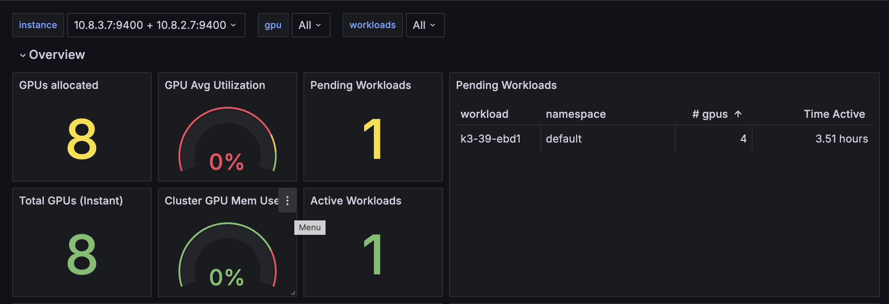
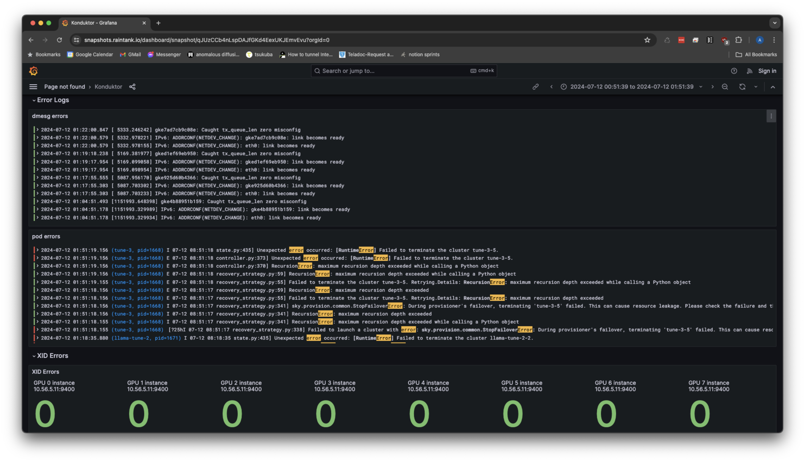
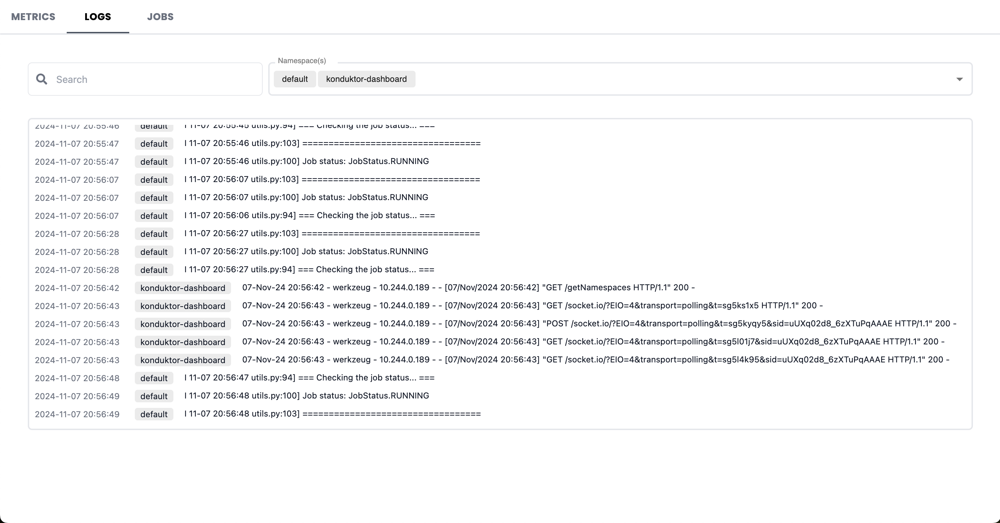
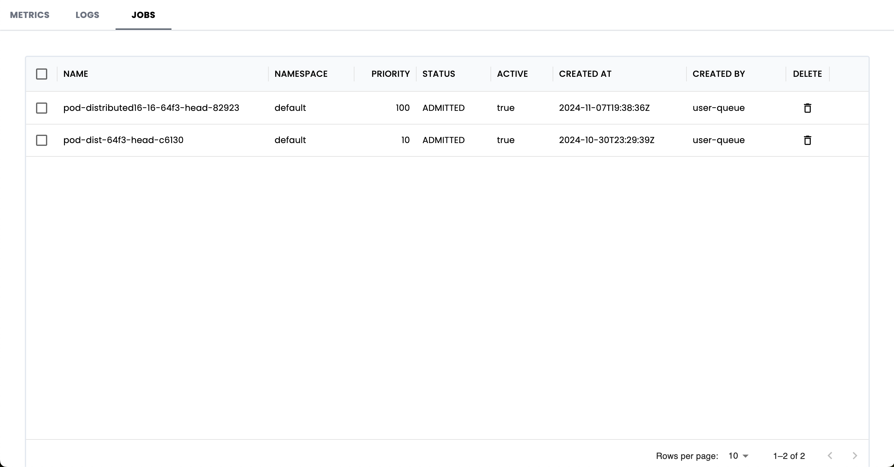

.. _observability:

=============
Observability
=============

.. raw:: html

   

   <a href="https://snapshots.raintank.io/dashboard/snapshot/qJUzCCb4nLspDAJfGKd4EexUKJEmvEvu?orgId=0">Interactive Grafana Dashboard Demo</a>
   

Access Grafana
--------------

A local Grafana instance is deployed as part of the observability stack.
The dashboard shows an overview of the available GPUs, pending/active workloads, and over all cluster utilization.

We can use :code:`kubectl port-forward` to access the grafana service from our laptop. For the example above,

.. code-block:: console

    $ kubectl port-forward -n prometheus svc/kube-prometheus-stack-grafana 3000:80

In the example above, we can enter :code:`https://localhost:3000/` into a browser window where it will prompt for a password. 
The default username is :code:`admin` with the password being set by :code:`kube-prometheus-stack.values` in :doc:`/admin/installation`.
**Administrators should secure this endpoint as well as changing the authentication login.**

Afterwards navigate to **Dashboards -> Konduktor** to access our provided dashboard

Metrics Dashboard
-----------------

Our metrics dashboard is included in the :code:`kube-prometheus-stack` installation using the `JSON definition from the repo <https://github.com/Trainy-ai/konduktor/tree/main/grafana>`_ under :code:`grafana/default_grafana_dashboard.json`
A interactive sample dashboard can be found `here <https://snapshots.raintank.io/dashboard/snapshot/qJUzCCb4nLspDAJfGKd4EexUKJEmvEvu>`_.

To track cluster GPU utilization, useful metrics to track include:

- GPU utilization
- GPU memory usage
- GPU SM efficiency

Multinode workloads performance benefits from tracking:

- NVLINK bandwidth
- Infiniband throughput (only for Infiniband networked setups)

For clusters with job queueing enabled we included:

- Jobs pending/active and number of GPUs requested
- Number of GPUs allocated vs free

Node level stats include:

- Disk usage
- CPU utilization

Reading Logs
------------

Included in the installation is a Loki logging backend and datasource.

Our default dashboard includes a panel for listing error logs from pods in the :code:`default` namespace. 
As well as (S)Xid errors by following :code:`dmesg` on each node. You can also perform arbitrary 
`LogQL <https://grafana.com/docs/loki/latest/query/>`_ queries by visiting the **Explore** tab.

Dashboard
------------

This is a user-friendly localhost dashboard to manage workloads within a cluster, all in one place. 

Features include:

- Grafana konduktor dashboard
- Loki logs (search + filtering by namespace)
- Table to view, delete, and modify priority of workloads in queue

To open the dashboard, run this inside the root konduktor directory:

.. code-block:: console

    $ ./start_dashboard.sh

