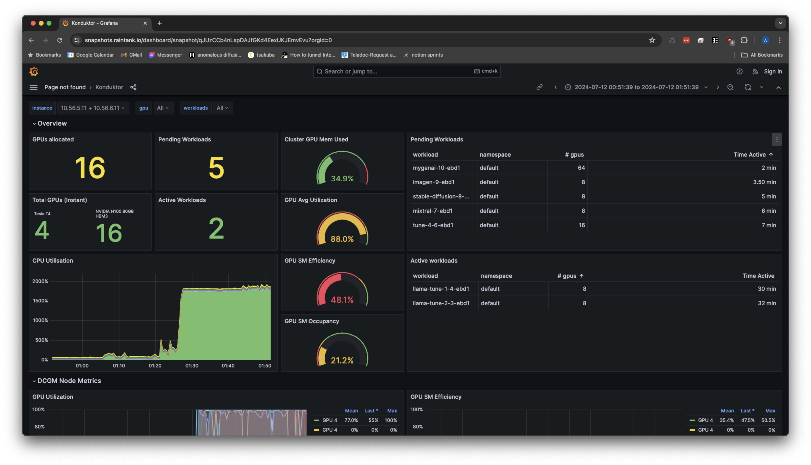

.. _observability:

Observability
=============

A local Grafana instance is deployed as part of the observability stack.
The dashboard shows an overview of the available GPUs, pending/active workloads, and over all cluster utilization.

.. code-block:: console

    # get the service name
    $ kubectl get svc -n prometheus | grep grafana
    kube-prometheus-stack-1717404158-grafana                    ClusterIP    10.122.81.251   <none>        80/TCP                    4d2h

We want this Grafana instance to be deployed as a :code:`NodePort`, so we will need to apply `this grafana patch <https://raw.githubusercontent.com/Trainy-ai/konduktor/main/manifests/grafana-patch.yaml>`_.
When applying the patch below, you will need to replace :code:`<svc-name>` with your corresponding service name. In our example, this would be :code:`kube-prometheus-stack-1717404158-grafana`.

.. code-block:: console
    # download patch
    $ wget https://raw.githubusercontent.com/Trainy-ai/konduktor/main/manifests/grafana-patch.yaml

    # REPLACE <svc-name> to apply patch
    $ kubectl patch svc <svc-name> \
        -n prometheus \
        --patch "$(cat grafana-patch.yaml)"

To then access the Grafana dashboard, we need to retrieve the port it's being served from and 
the IP address of any node.

.. code-block:: console

    # get a node IP
    $ kubectl get nodes -o wide
    NAME                                       STATUS   ROLES    AGE     VERSION               INTERNAL-IP   EXTERNAL-IP      OS-IMAGE             KERNEL-VERSION    CONTAINER-RUNTIME
    gke-cluster-2-default-pool-592b9575-4svd   Ready    <none>   4d22h   v1.28.9-gke.1000000   10.128.0.90   80.184.157.133   Ubuntu 22.04.4 LTS   5.15.0-1054-gke   containerd://1.7.13

    # get the service port
    $ kubectl get svc -n prometheus | grep grafana
    kube-prometheus-stack-1717404158-grafana                    NodePort    10.122.81.251   <none>        80:31990/TCP                    4d2h

In the example above, we can enter :code:`80.184.157.133:31990` into a browser window where it will prompt for a password. 
The default username is :code:`admin` with the password being set by :code:`kube-prometheus-stack.values` in :doc:`/getting-started/installation`.
**Administrators should secure this endpoint as well as changing the authentication login.**

After logging in, you can import our default dashboard by either using the JSON definition from the repo under :code:`grafana/default_grafana_dashboard.json`
or by downloading from `our Grafana published dashboard <https://grafana.com/grafana/dashboards/21231-konduktor-dashboard/>`_.
An interactive sample dashboard can be found `here <https://snapshots.raintank.io/dashboard/snapshot/1XTdClbc31qcUEK9Sv4wqcJScQHYBZzj?orgId=0>`_.

In case you're still experiencing connectivity issues, ask your k8s admin to check your firewall. For example, we need to run the following command when running on Google Cloud:

.. code-block:: console

    $ gcloud compute firewall-rules create $NAME --allow tcp:$PORT
