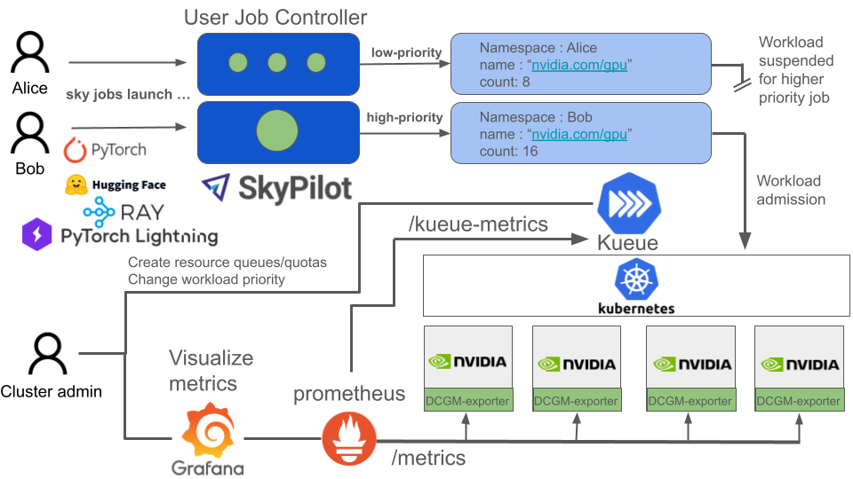

.. Konduktor documentation master file, created by
   sphinx-quickstart
   You can adapt this file completely to your liking, but it should at least
   contain the root `toctree` directive.

Welcome to Konduktor's documentation!
=====================================

.. raw:: html

   

   
   
   <a class="github-button" href="https://github.com/Trainy-ai/konduktor" data-show-count="true" data-size="large" aria-label="Star Konduktor on GitHub">Star</a>
   

   

   <strong>Batch Jobs and Cluster Management for GPUs on Kubernetes</strong>
   

   Konduktor is a platform designed for running ML batch jobs and managing GPU clusters. Konduktor uses existing open source tools to build a platform that empowers ML engineers by abstracting away the details of resource scheduling so they can focus on modeling. Cluster administrators will enjoy setting resource quotas and sharing between projects as well as built in monitoring to track cluster-wide resource utilization and pending jobs to adjust quotas according to organizational priorities, reduce resource idling, and observe cluster GPU and fabric health.

- Easy scale out and job queueing and multi-node scheduling
- Share resources with quotas across projects via namespaces
- Track active and pending jobs and utilization, power usage, etc.
- Node level metrics for monitoring cluster health

Documentation
-------------

.. toctree::
   :maxdepth: 1
   :caption: Cluster Administration
   
   admin/installation
   admin/observability

.. toctree::
   :maxdepth: 1
   :caption: Job Scheduling

   usage/quickstart
   

External Links
--------------------------

- `Trainy Developer Blog <https://trainy.ai/blog>`_

This project is powered by:

- `SkyPilot <https://skypilot.readthedocs.io/en/latest/>`_
- `Kueue <https://kueue.sigs.k8s.io/>`_
- `Prometheus <https://prometheus.io/>`_
- `Grafana <https://grafana.com/oss/grafana/>`_
- `OpenTelemetry <https://opentelemetry.io/>`_
- `Kubernetes <https://kubenetes.io>`_